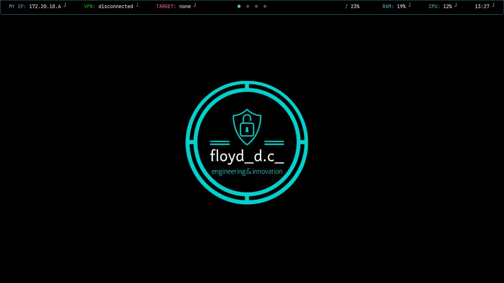
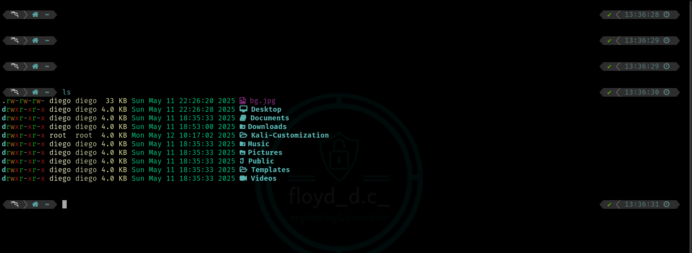

# Automatic Customization
Script and files to customize your Linux environment.  
_Tested on Kali Linux 2024.4 and 2025.1c_

## Recommended initial phase
- `sudo apt update`
- `sudo apt upgrade`

## USAGE
- `sudo -s` to log in as superuser
- `chmod +x installer.sh installer2.sh` to give scripts execution permissions
- `./installer.sh` to run the first script
- Wait for the end of the first installation, so don't close anything
- `./installer2.sh` to run the second script

## Further actions to do
- Restart your Terminal to apply changes on Polybar and Terminal
- Restart your machine to apply changes on Terminal top border

## Useful shortcuts (to set)
_Super is the Windows button_
- `Keyboard settings -> Shortcuts`:
  - Run Terminal
    - COMMAND: `Super + Enter`
    - SHORTCUT: `qterminal`
  - Run Rofi application manager
    - COMMAND: `Super`
    - SHORTCUT: `rofi -show run -config /usr/share/rofi/themes/theme.rasi`
  - Run Firefox browser
    - COMMAND: `Super + B`
    - SHORTCUT: `firefox`
  - Run Thunar file manager
    - COMMAND: `Super + F`
    - SHORTCUT: `thunar` 

- `Terminal -> Preferences`:
  - Split Terminal vertically 
    - SHORTCUT: `Ctrl + V` 
  - Split Terminal horizontally   
    - SHORTCUT: `Ctrl + H` 
  - Quit Terminal 
    - SHORTCUT: `Ctrl + Q` 
  - Close subTerminal (previously opened vertically/horizontally)   
    - SHORTCUT: `Ctrl + W` 

## Other features (to set)
- `Desktop settings -> Menu`: uncheck "Include applications menu on desktop right click" and "Show window list menu on desktop middle click"
- `Desktop settings -> Desktop icons`: Icon type -> None

## Screenshots

