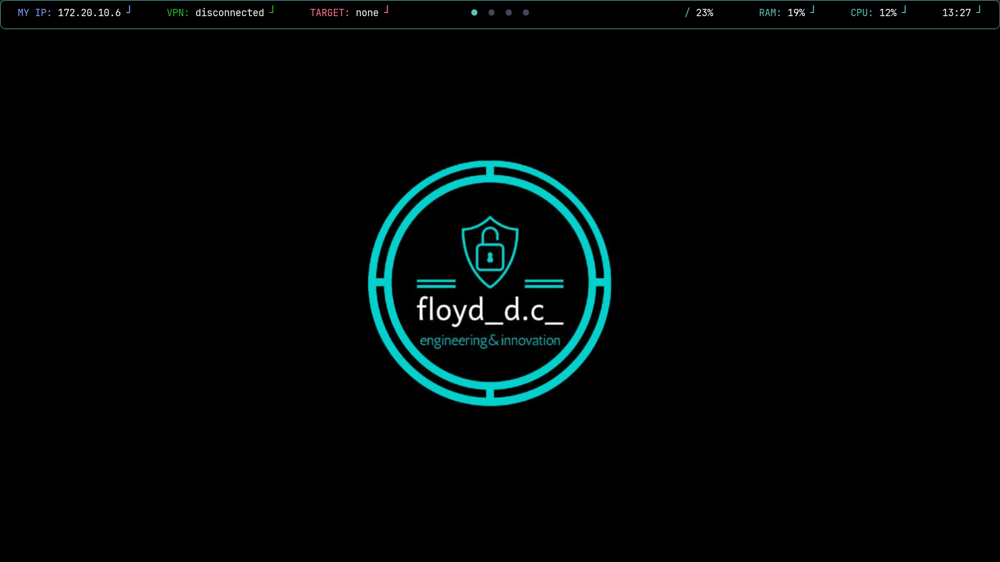
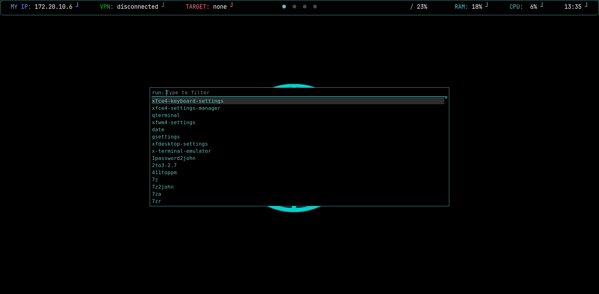
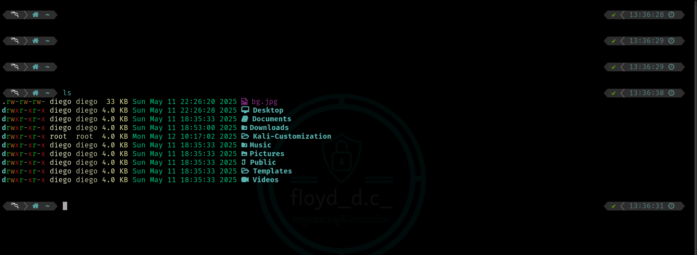

# Automatic Customization
Script and files to customize your Linux environment.  
_Tested on Kali Linux 2024.4_

## Usage
- `sudo -s` to log in as superuser
- `chmod +x installer.sh installer2.sh` to give scripts execution permissions
- `./installer.sh` to run the first script
- Wait the end of the first installation
- `./installer2.sh` to run the second script
- Restart your Terminal to apply changes

## Recommended initial phase
- `sudo apt update`
- `sudo apt upgrade`

## Screenshots

