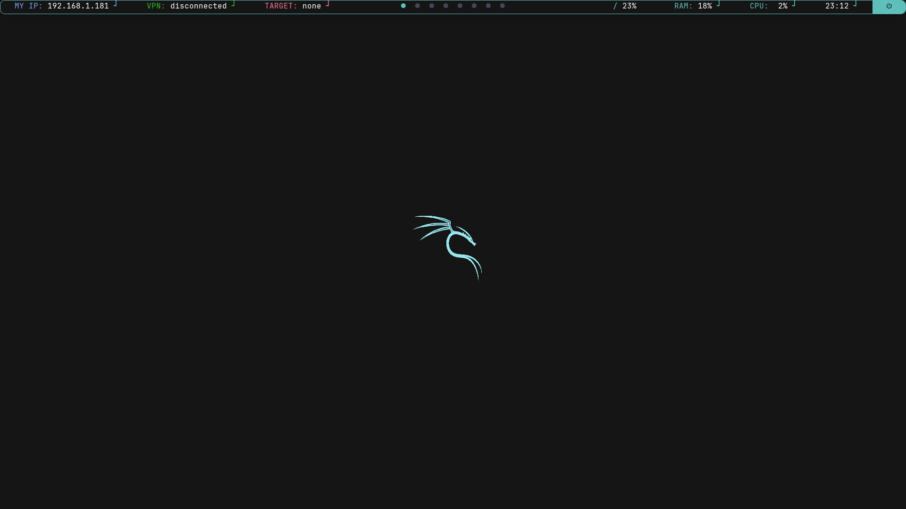
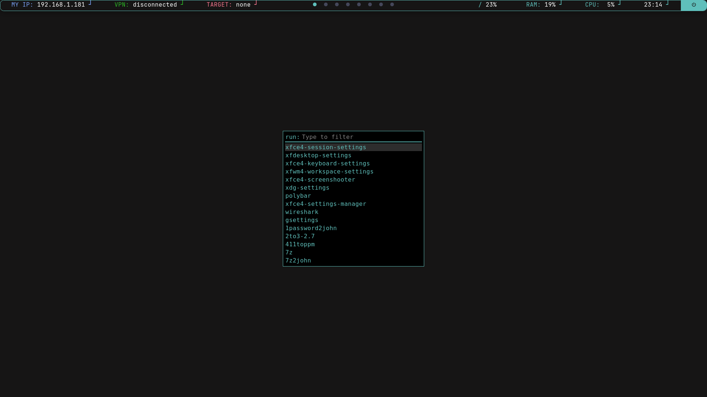
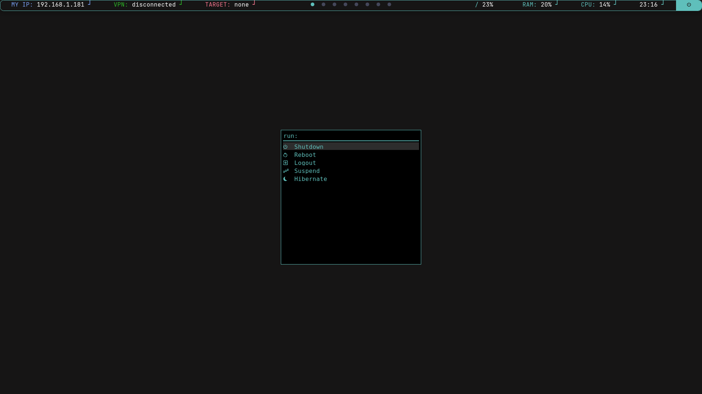
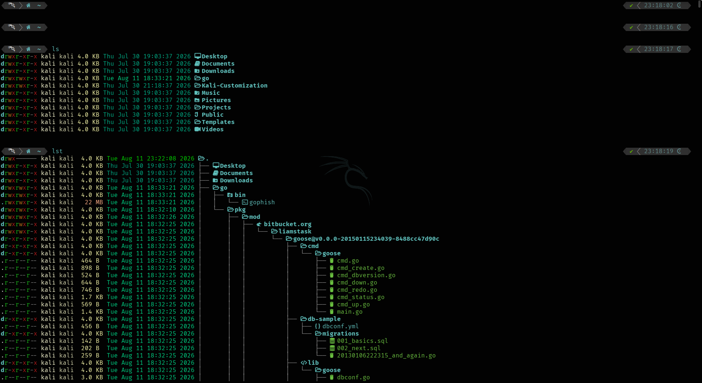
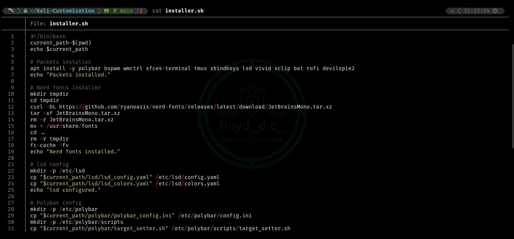
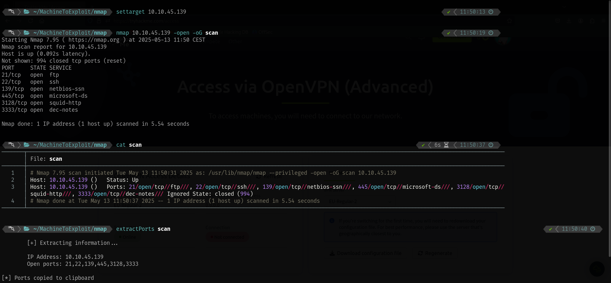

# 👨🏻‍💻 Automatic Kali Linux customization
Script and files to customize your Kali Linux environment.  
_Tested up to Kali Linux 2026.2_

- [Usage](#-usage)
- [What does the script do?](#-what-does-the-script-do)
- [Screenshots](#-screenshots)

## 🚀 Usage
- `git clone github.com/floyddc/Kali-Customization`

- `cd Kali-Customization`

- `chmod +x kali-customize.sh`

- `./kali_customization.sh` (do NOT run as root)

## ✅ What does the script do?
1) Creates a backup.

2) Updates the system.

3) Installs packages.

4) Download this repository and validates it.

5) Setups:

    - Jetbrains Mono Nerd Font.

    - LSD.
    
    - Polybar.

    - Vivid.

    - Rofi application manager.

    - QTerminal (user preferencies) / Devilspie2.

        - Font size: `12pt`.

        - Color scheme: `Linux`.

        - Terminal transparency: `10%`. 

    - Oh-My-Zsh.

    - Powerlevel10k.

    - Zsh configuration (for existing and new users).

6) Sets Xfce shortcuts:

    - Run Terminal: `Windows + Enter` (`Esc` to close).

    - Run Rofi: `Windows + R`.

    - Run Firefox browser: `Windows + B`.

    - Run Thunar file manager: `Windows + F`. 

7) Configures Xfce desktop:

    - Right-click application menu disabled.

    - Middle-click window list disabled.

    - Icons disabled.

    - Number of workspaces: `8`.

    - Background solid color: `#161515`.

    - Panel disabled.

8) Sets Bash aliases:
    - `ip` instead of `ifconfig`.

    - `cls` instead of `clear`.

    - `ls` instead of `lsd -l` (lists files/dirs with nerd fonts).

    - `lst` instead of `ls -tree` (prints files/dirs tree).

    - `cat` instead of `batcat py` (prints file with highlighted lines).

    - `off` instead of `poweroff`.

9) Sets user commands (utilities):

    - `settarget <IP>` (sets your target IP address on your Polybar).

    - `extractPorts <file>` (extracts open ports from a grepable file and copies them on your clipboard).
   
10) Updates PATH.

11) Refreshes all.

12) Prints a resume.

**⚠️ Reboot the OS to apply all changes!** 
   - `sudo reboot`.

## 📸 Screenshots
 

 

 

 

 

